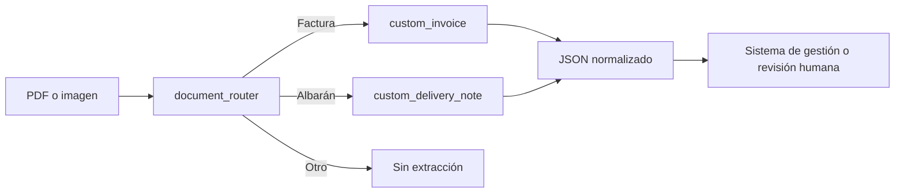

# Procesamiento de facturas y albaranes con Azure

> [Read the main documentation in English](README.md)

Este proyecto es una prueba de concepto en Python para organizaciones que reciben facturas y
albaranes de muchos proveedores con formatos diferentes. Permite:

1. Crear un analizador de facturas en Azure Content Understanding.
2. Crear un analizador de albaranes con un esquema específico.
3. Crear un clasificador que decide si un documento es una factura, un albarán u otro tipo.
4. Procesar un PDF o una imagen con Content Understanding.
5. Procesar el mismo documento con Document Intelligence `prebuilt-invoice`.
6. Comparar ambos resultados con datos correctos preparados por una persona.

No incluye documentos reales porque pueden contener información confidencial. Para probarlo hay
que proporcionar PDFs o imágenes propios.

## 1. Qué problema resuelve

`prebuilt-invoice` de Document Intelligence tiene un esquema fijo pensado para facturas. Funciona
bien en muchos casos, pero puede no cubrir campos particulares, albaranes o formatos muy variables.

Content Understanding permite definir qué campos queremos obtener y describirlos con lenguaje
natural. En este ejemplo se crean dos analizadores independientes:

- `custom_invoice`: extrae facturas con un esquema adaptable al sistema de destino.
- `custom_delivery_note`: extrae albaranes de distintos proveedores.

Un tercer analizador, `document_router`, clasifica el documento y lo envía al analizador
correcto.



La recomendación es mantener un analizador por tipo documental, no uno por centro, unidad de negocio
o proveedor. Los casos difíciles se incorporan después como ejemplos etiquetados.

## 2. Conceptos básicos

### Analizador

Es la configuración que indica a Content Understanding qué documento recibe, qué campos debe
extraer y qué modelos puede utilizar. En este proyecto las configuraciones están en
[`templates.py`](src/invoice_demo/templates.py).

### Clasificador o router

Es un analizador que identifica el tipo de documento. Aquí distingue entre factura, albarán y
otros documentos. No sustituye a los analizadores de extracción: los selecciona.

### Modelo de completion

Es el modelo GPT que interpreta el contenido y genera la salida estructurada. El valor inicial es
`gpt-5.2`, pero se puede cambiar con `CU_COMPLETION_MODEL` si Content Understanding y el analizador
admiten otro modelo.

### Modelo de embeddings

Convierte los ejemplos etiquetados en representaciones numéricas para encontrar los más parecidos
al documento que se está procesando. El ejemplo declara `text-embedding-3-large` para que los
analizadores estén preparados para incorporar esos ejemplos.

Declarar el modelo no significa que siempre vaya a consumir tokens de embeddings. El consumo
aparece cuando se añade una fuente de conocimiento con ejemplos etiquetados. Debe comprobarse en
`usage.tokens` después de cada análisis.

### Grounding y confidence score

- `grounding` indica dónde se encontró un valor en el documento.
- `confidence score` indica la confianza estimada para ese campo, entre 0 y 1.

Una confianza alta no garantiza que el valor sea correcto. Los umbrales de revisión deben definirse
con documentos reales y por campo. Un total económico suele necesitar un umbral más estricto que
una observación libre.

### Verdad fundamental

Es un JSON escrito o revisado por una persona con los valores correctos de un documento. Sirve para
medir la precisión y no debe confundirse con grounding.

## 3. Qué necesitas en Azure

Antes de ejecutar el ejemplo necesitas:

1. Una suscripción de Azure.
2. Un recurso de Microsoft Foundry compatible con Content Understanding.
3. Un recurso de Azure Document Intelligence para ejecutar la comparación.
4. Un deployment de un modelo de completion admitido, inicialmente `gpt-5.2`.
5. Un deployment de `text-embedding-3-large` si se preparará el uso de ejemplos etiquetados.
6. El rol `Cognitive Services User` sobre los recursos para la identidad que ejecuta el ejemplo.

Consulta siempre las regiones y modelos vigentes:

- [Documentación de Content Understanding](https://learn.microsoft.com/azure/ai-services/content-understanding/)
- [Modelos y deployments](https://learn.microsoft.com/azure/ai-services/content-understanding/concepts/models-deployments)
- [Límites y modelos admitidos](https://learn.microsoft.com/azure/ai-services/content-understanding/service-limits)

El catálogo de Foundry puede contener modelos que Content Understanding todavía no admite. El
comando `inspect` permite comprobar los modelos válidos para un analizador concreto.

### 3.1. Crear el recurso para Content Understanding

1. Entra en [Azure Portal](https://portal.azure.com/).
2. Selecciona **Crear un recurso** y busca **Microsoft Foundry**.
3. Elige una región compatible con Content Understanding y crea el recurso.
4. Abre el recurso y copia su endpoint desde **Keys and Endpoint**. Es el valor de
  `CONTENTUNDERSTANDING_ENDPOINT`.
5. Abre Content Understanding Studio, entra en **Settings** y conecta el recurso.

Los nombres exactos de las opciones pueden cambiar ligeramente en el portal. El endpoint suele
terminar en `.services.ai.azure.com/`; no debe confundirse con el nombre del recurso ni con una
clave.

### 3.2. Desplegar los modelos

En el recurso de Foundry, abre la sección de deployments y crea:

1. Un deployment de `gpt-5.2`, o de otro modelo que el analizador admita.
2. Un deployment de `text-embedding-3-large` para preparar el uso de ejemplos etiquetados.

Anota el nombre de cada deployment. Puedes llamar al deployment igual que al modelo para reducir
confusiones, pero no es obligatorio.

### 3.3. Crear Document Intelligence

1. En Azure Portal selecciona **Crear un recurso**.
2. Busca **Document Intelligence** y crea el recurso.
3. Abre **Keys and Endpoint** y copia el endpoint. Es el valor de
  `DOCUMENTINTELLIGENCE_ENDPOINT`.

Este recurso solo se utiliza para obtener una línea base con `prebuilt-invoice`. Si no se quiere
hacer esa comparación, las operaciones `setup`, `inspect` y `analyze --provider cu` no lo necesitan.

### 3.4. Conceder permisos

En cada recurso:

1. Abre **Access control (IAM)**.
2. Selecciona **Add role assignment**.
3. Asigna el rol **Cognitive Services User** a tu usuario para las pruebas locales.
4. En producción, asigna el rol a la identidad administrada de la aplicación.

La asignación puede tardar unos minutos en propagarse. Ser propietario de la suscripción no siempre
sustituye el rol de acceso a datos que necesita el SDK.

## 4. Instalación local

Se necesita Python 3.11 o posterior. Desde la carpeta del proyecto:

```bash
python3 -m venv .venv
source .venv/bin/activate
python -m pip install --upgrade pip
python -m pip install -e ".[dev]"
```

El proyecto utiliza los SDK oficiales:

- `azure-ai-contentunderstanding`
- `azure-ai-documentintelligence`
- `azure-identity`

## 5. Autenticación

El código no guarda claves. Utiliza `DefaultAzureCredential`, que funciona con distintas fuentes de
identidad. Para desarrollo local, la opción más sencilla es iniciar sesión con Azure CLI:

```bash
az login
```

En producción se recomienda una identidad administrada. El código no cambia al pasar de Azure CLI
a identidad administrada.

## 6. Configuración

Abre [`.env.example`](.env.example) para ver todas las variables. El proyecto no carga el archivo
automáticamente: hay que exportar los valores en la terminal.

```bash
export CONTENTUNDERSTANDING_ENDPOINT="https://<recurso>.services.ai.azure.com/"
export DOCUMENTINTELLIGENCE_ENDPOINT="https://<recurso>.cognitiveservices.azure.com/"

export CU_COMPLETION_MODEL="gpt-5.2"
export CU_COMPLETION_DEPLOYMENT="<nombre-del-deployment-gpt-5.2>"

export CU_EMBEDDING_MODEL="text-embedding-3-large"
export CU_EMBEDDING_DEPLOYMENT="<nombre-del-deployment-de-embeddings>"
```

Hay dos nombres distintos que conviene no mezclar:

- **Modelo**: por ejemplo, `gpt-5.2`.
- **Deployment**: el nombre asignado al desplegar ese modelo en el recurso.

El comando `setup` registra los deployments como valores predeterminados del recurso cuando las
variables `CU_COMPLETION_DEPLOYMENT` y `CU_EMBEDDING_DEPLOYMENT` están definidas. Si el recurso ya
tiene defaults correctos, esas dos variables son opcionales.

## 7. Crear los analizadores

Ejecuta:

```bash
invoice-demo setup
```

Se crean en este orden:

1. `custom_invoice`
2. `custom_delivery_note`
3. `document_router`

El orden importa porque el router referencia los otros dos. Para sustituir analizadores existentes:

```bash
invoice-demo setup --replace
```

No uses `--replace` en producción sin guardar y probar la versión anterior.

## 8. Comprobar los modelos compatibles

Para inspeccionar el router:

```bash
invoice-demo inspect document_router
```

Para comprobar el analizador preconstruido de facturas:

```bash
invoice-demo inspect prebuilt-invoice
```

La salida incluye dos listas:

- `completion`: modelos GPT admitidos.
- `embedding`: modelos de embeddings admitidos.

Esta consulta es la referencia correcta antes de cambiar de modelo. No debe asumirse compatibilidad
solo porque un modelo aparezca en el catálogo general de Foundry.

## 9. Analizar un documento

### Con Content Understanding

```bash
invoice-demo analyze ./documentos/factura-001.pdf \
  --provider cu \
  --output ./results/factura-001-cu.json
```

El router decide si el documento es una factura o un albarán.

### Con Document Intelligence

```bash
invoice-demo analyze ./documentos/factura-001.pdf \
  --provider di \
  --output ./results/factura-001-di.json
```

Document Intelligence utiliza `prebuilt-invoice` de forma predeterminada. En albaranes actúa como
línea base; es normal que no reconozca campos específicos del albarán.

## 10. Preparar la verdad fundamental

Hay dos ejemplos editables:

- [Factura](examples/ground_truth.invoice.json)
- [Albarán](examples/ground_truth.delivery_note.json)

Copia el que corresponda y reemplaza todos los valores por los que aparecen realmente en el
documento. Se pueden eliminar campos que no se quieran evaluar.

No incluyas un valor inventado para un campo ausente. Si el campo no aparece y no forma parte del
criterio de éxito, elimínalo del JSON.

### 10.1. Dataset público recomendado: FATURA

[FATURA](https://zenodo.org/records/8261508) es un buen punto de partida para probar facturas:

- 10.000 imágenes JPG sintéticas.
- 50 layouts distintos, con 200 variantes por layout.
- Un JSON de anotaciones por imagen en tres formatos: original, COCO y Hugging Face.
- 24 clases, con texto y coordenadas de cada región.
- Licencia [CC BY 4.0](https://creativecommons.org/licenses/by/4.0/): se puede reutilizar
  manteniendo la atribución.
- Descarga abierta de aproximadamente 363,5 MB.

El dataset se descarga desde Zenodo. No se incluye en este repositorio por su tamaño:

```bash
mkdir -p datasets/fatura
curl -L \
  "https://zenodo.org/api/records/8261508/files/FATURA.zip/content" \
  -o datasets/fatura/FATURA.zip
unzip datasets/fatura/FATURA.zip -d datasets/fatura
```

También existe el mirror comunitario
[`tasiam/FATURA2-invoices`](https://huggingface.co/datasets/tasiam/FATURA2-invoices), que es más
cómodo para trabajar desde Python. Contiene 10.000 registros en Parquet, con 8.600 en `train` y
1.400 en `test`. Cada registro expone:

- `image`: imagen de la factura.
- `tokens`: palabras reconocidas.
- `ner_tags`: etiqueta numérica de cada palabra.
- `bboxes`: coordenadas de cada palabra.
- `id`: identificador numérico del registro.

Puede cargarse con la librería `datasets` de Hugging Face:

```bash
python -m pip install datasets
```

```python
from datasets import load_dataset

dataset = load_dataset("tasiam/FATURA2-invoices")
sample = dataset["test"][0]
sample["image"].save("factura-fatura.jpg")
print(sample["tokens"][:10])
```

Este mirror no es la publicación oficial de los autores. Además, su esquema declara `ner_tags`
como enteros ordinarios, sin publicar los nombres de las clases como `ClassLabel`, y su `id` no
identifica claramente el template. Por ello:

- Es apropiado para descargar imágenes rápidamente y hacer una prueba manual.
- No debe asumirse que su split `train`/`test` separa layouts conocidos y desconocidos.
- No permite convertir las etiquetas a nuestro esquema de forma fiable sin recuperar el mapa de
  clases de las anotaciones originales.
- Zenodo debe conservarse como fuente de referencia para anotaciones, splits, licencia y cita.

FATURA **no puede usarse directamente** como archivo de verdad fundamental de
`invoice-demo compare`.
Sus clases describen regiones del documento y deben convertirse al contrato de este proyecto. Un
mapeo inicial sería:

| FATURA | Campo del proyecto |
| --- | --- |
| `SELLER NAME` | `SupplierName` |
| `SELLER ADDRESS` | No se evalúa actualmente |
| `NUMBER` | `InvoiceNumber` |
| `DATE` | `InvoiceDate` |
| `PO NUMBER` | `PurchaseOrderNumber` |
| `BUYER`, `BILL TO` o `SEND TO` | `RecipientName` |
| `SUB-TOTAL` | `Subtotal` |
| `TAX` o `GST` | `TaxAmount` |
| `TOTAL` | `TotalAmount` |
| `DUE DATE` | `PaymentDueDate` |

El mapeo debe revisarse manualmente porque `BUYER`, `BILL TO` y `SEND TO` no siempre representan el
mismo concepto. Además, la anotación `TABLE` identifica la región completa de la tabla; no garantiza
una verdad fundamental detallada para cada descripción, cantidad, precio y total de línea. Por
tanto:

- Es adecuado para comprobar OCR, clasificación y campos de cabecera/totales.
- Es útil para comparar generalización entre layouts conocidos y desconocidos.
- Es insuficiente para validar por sí solo las líneas de detalle del esquema actual.
- No contiene albaranes.

Para evitar una evaluación demasiado optimista, divide por **template**, no aleatoriamente por
imagen. Por ejemplo, usa layouts 1-35 para ajustar el analizador, 36-42 para validación y 43-50 para
prueba final. Así los layouts de prueba no aparecen entre los ejemplos etiquetados.

### 10.2. Muestra recomendada para una PoC real

FATURA demuestra que la integración funciona con facturas variadas, pero no demuestra que funcione
con los documentos de una organización concreta. La evaluación final debería combinar:

1. Entre 100 y 300 facturas reales anonimizadas, repartidas entre proveedores y formatos.
2. Entre 100 y 300 albaranes reales anonimizados.
3. Casos difíciles: escaneos, fotos, tablas en varias páginas, campos ausentes y anotaciones.
4. Al menos un 20 % reservado para prueba final y nunca utilizado como ejemplo etiquetado.

Para una primera prueba barata pueden seleccionarse 50 imágenes de FATURA, una por layout, y crear
manualmente sus JSON de verdad fundamental con el formato de
[`ground_truth.invoice.json`](examples/ground_truth.invoice.json). Después de validar el flujo se
automatiza la conversión de las anotaciones que sean inequívocas.

## 11. Comparar Content Understanding y Document Intelligence

```bash
invoice-demo compare \
  ./documentos/factura-001.pdf \
  ./mi-ground-truth/factura-001.json \
  --output ./results/comparacion-factura-001.json
```

El proyecto traduce los nombres estándar de Document Intelligence al contrato del ejemplo. Por
ejemplo:

| Document Intelligence | Contrato común |
| --- | --- |
| `VendorName` | `SupplierName` |
| `InvoiceId` | `InvoiceNumber` |
| `InvoiceTotal` | `TotalAmount` |
| `Items` | `LineItems` |

Esto evita declarar un error cuando ambos servicios devuelven el mismo dato con nombres distintos.

La evaluación compara todas las hojas del JSON, incluidas las líneas. Los textos ignoran diferencias
de mayúsculas y espacios. Los números admiten una diferencia máxima de `0.01`.

## 12. Cómo leer el resultado

Cada proveedor devuelve:

- `duration_ms`: tiempo total de la llamada observado por el cliente.
- `documents`: documentos extraídos.
- `fields`: valor, confianza y origen de cada campo.
- `usage`: unidades consumidas que devuelve el servicio.
- `evaluation`: aciertos, ausencias, diferencias y precisión sobre la verdad fundamental.

Ejemplo simplificado:

```json
{
  "matched": 18,
  "expected": 20,
  "accuracy": 0.9,
  "missing": ["LineItems[1].SupplierItemCode"],
  "mismatched": [
    {
      "path": "TotalAmount",
      "expected": 121.0,
      "actual": 112.0
    }
  ]
}
```

`accuracy` mide hojas correctas, no documentos completos. Para una PoC real conviene añadir:

- Exactitud por campo.
- Porcentaje de documentos sin ningún error crítico.
- STP: documentos que no necesitan revisión humana.
- Precisión de líneas de detalle.
- Latencia por percentiles, no solo la media.
- Coste observado por documento y por página.

## 13. Coste

El coste de Content Understanding no es solo el modelo GPT:

```text
extracción + contextualización + tokens de entrada/salida + embeddings
```

La respuesta de CU incluye páginas, tokens de contextualización y tokens agrupados por modelo. El
proyecto los conserva en `usage`. Los precios no están codificados porque cambian por modelo,
deployment y región; deben aplicarse después usando la tarifa vigente.

Los ejemplos etiquetados pueden aumentar el consumo de embeddings y el contexto enviado al modelo
de completion. Por eso el coste definitivo debe medirse durante la PoC.

## 14. Añadir ejemplos etiquetados

Empieza sin ejemplos. Revisa los errores y añade ejemplos solo para proveedores o formatos que
fallen de forma repetida.

Un conjunto razonable debe:

1. Cubrir proveedores y layouts distintos.
2. Incluir escaneos de calidad buena y mala.
3. Separar los documentos usados como ejemplo de los usados para evaluar.
4. Mantener una muestra de validación que el analizador nunca haya visto.

Los ejemplos etiquetados se pueden gestionar desde Content Understanding Studio o con el SDK. Este
proyecto deja configurado el modelo de embeddings, pero no sube ejemplos automáticamente para evitar
publicar datos sensibles por accidente.

## 15. Seguridad y datos personales

- No subas facturas reales al repositorio.
- No guardes claves en `.env.example`, código o control de versiones.
- Usa identidad administrada en producción.
- Revisa los requisitos de residencia y privacidad antes de usar deployments globales.
- Decide cuánto tiempo conservar los resultados estructurados y los documentos originales.
- Evita registrar OCR completo, NIF, cuentas bancarias o direcciones en logs de aplicación.

La carpeta `results/` está excluida de Git, pero eso no sustituye una política de datos.

## 16. Errores frecuentes

### `Set CONTENTUNDERSTANDING_ENDPOINT...`

Falta exportar el endpoint de Content Understanding en la terminal actual.

### Error de autenticación o autorización

Comprueba que se ejecutó `az login`, que la cuenta está en el tenant correcto y que tiene el rol
`Cognitive Services User` sobre el recurso.

### `Model deployments not configured`

Comprueba los nombres de los deployments y vuelve a ejecutar `invoice-demo setup --replace`. El
nombre del modelo y el nombre del deployment pueden ser diferentes.

### Modelo no admitido

Ejecuta `invoice-demo inspect <analyzer-id>` y selecciona un modelo de `supported_models`. La
disponibilidad en Foundry no implica compatibilidad automática con Content Understanding.

### El router devuelve `other`

Revisa si el documento realmente contiene señales suficientes para distinguir factura y albarán.
Después ajusta las descripciones de las categorías y prueba de nuevo con documentos variados.

### El OCR reconoce mal un carácter

Los ejemplos etiquetados ayudan con formatos y significado, pero no corrigen necesariamente errores
de OCR. Revisa la resolución, orientación y calidad del documento original.

## 17. Validación local del proyecto

Las pruebas no llaman a Azure y no consumen crédito:

```bash
ruff check src tests
pytest
```

Una ejecución real contra Azure no puede automatizarse sin endpoints, permisos, deployments y
documentos proporcionados por el usuario.
