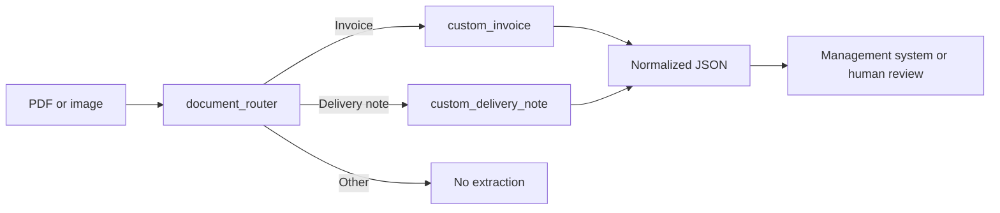

# Invoice and Delivery Note Processing with Azure

> [Leer esta documentación en español](README.es.md)

This Python proof of concept is designed for organizations that receive invoices and delivery
notes from many suppliers using different layouts. It can:

1. Create a custom invoice analyzer in Azure Content Understanding.
2. Create a custom delivery-note analyzer with a dedicated schema.
3. Create a router that classifies a document as an invoice, delivery note, or another type.
4. Process a PDF or image with Content Understanding.
5. Process the same document with Document Intelligence `prebuilt-invoice`.
6. Compare both results against human-reviewed ground truth.

The repository does not include real business documents because they may contain confidential
information. A synthetic FATURA invoice is included for a repeatable smoke test.

## Architecture

Document Intelligence `prebuilt-invoice` uses a fixed invoice schema. It performs well in many
cases, but it may not cover organization-specific fields, delivery notes, or highly variable
supplier layouts.

Content Understanding lets you define fields and describe their meaning in natural language. This
sample creates:

- `custom_invoice`: extracts invoices into an adaptable schema.
- `custom_delivery_note`: extracts delivery notes from different suppliers.
- `document_router`: classifies each input and invokes the correct extractor.



Keep one analyzer per document type rather than one analyzer per supplier or business unit. Add
labeled examples later for layouts that repeatedly fail.

## Core Concepts

### Analyzer

An analyzer defines the accepted content, fields to extract, and models it can use. Definitions
are in [`templates.py`](src/invoice_demo/templates.py).

### Completion and embedding models

The completion model interprets the document and creates structured output. This sample defaults
to `gpt-5.2`.

The embedding model helps retrieve labeled examples similar to the current document. The sample
declares `text-embedding-3-large`, preparing the analyzers for future in-context learning. Declaring
it does not mean every request consumes embedding tokens; inspect `usage.tokens` in the response.

### Grounding, confidence, and ground truth

- **Grounding** identifies where an extracted value appears in the source document.
- **Confidence** estimates certainty for a field from 0 to 1. It does not guarantee correctness.
- **Ground truth** is a human-reviewed JSON file containing the correct values for evaluation.

Define human-review thresholds from real documents and per field. Financial totals usually need
stricter thresholds than free-text notes.

## Azure Prerequisites

You need:

1. An Azure subscription.
2. A Microsoft Foundry resource in a region supported by Content Understanding.
3. A Document Intelligence resource for the baseline comparison.
4. A deployment of a supported completion model, initially `gpt-5.2`.
5. A `text-embedding-3-large` deployment if labeled examples will be used.
6. The `Cognitive Services User` role for the identity running this sample.

Check current support before provisioning:

- [Content Understanding documentation](https://learn.microsoft.com/azure/ai-services/content-understanding/)
- [Models and deployments](https://learn.microsoft.com/azure/ai-services/content-understanding/concepts/models-deployments)
- [Service limits and supported models](https://learn.microsoft.com/azure/ai-services/content-understanding/service-limits)

The Foundry catalog may contain models that Content Understanding does not support. Use
`invoice-demo inspect` to retrieve valid models for an analyzer.

### Create the resources

1. Open the [Azure portal](https://portal.azure.com/).
2. Create a **Microsoft Foundry** resource in a supported region.
3. Copy its `.services.ai.azure.com` endpoint from **Keys and Endpoint**.
4. Deploy `gpt-5.2` and `text-embedding-3-large` in that resource.
5. Create **Document Intelligence** and copy its `.cognitiveservices.azure.com` endpoint.
6. Assign **Cognitive Services User** to your local user or production managed identity.

The model name and deployment name are different concepts. A deployment can use the model name as
its name, but this is not required.

## Local Installation

Python 3.11 or later is required:

```bash
python3 -m venv .venv
source .venv/bin/activate
python -m pip install --upgrade pip
python -m pip install -e ".[dev]"
```

The project uses official Azure SDK packages:

- `azure-ai-contentunderstanding`
- `azure-ai-documentintelligence`
- `azure-identity`

## Authentication

The code uses `DefaultAzureCredential` and stores no access keys. For local development:

```bash
az login
```

Use managed identity in production. The application code remains unchanged.

## Configuration

See [`.env.example`](.env.example) for all variables. Export the values in your shell; the project
does not automatically load the file.

```bash
export CONTENTUNDERSTANDING_ENDPOINT="https://<resource>.services.ai.azure.com/"
export DOCUMENTINTELLIGENCE_ENDPOINT="https://<resource>.cognitiveservices.azure.com/"

export CU_COMPLETION_MODEL="gpt-5.2"
export CU_COMPLETION_DEPLOYMENT="<gpt-5.2-deployment-name>"

export CU_EMBEDDING_MODEL="text-embedding-3-large"
export CU_EMBEDDING_DEPLOYMENT="<embedding-deployment-name>"
```

When deployment variables are defined, `setup` registers them as resource defaults. They are
optional if correct defaults already exist.

## Create the Analyzers

```bash
invoice-demo setup
```

The command creates:

1. `custom_invoice`
2. `custom_delivery_note`
3. `document_router`

The order matters because the router references both extraction analyzers. To replace existing
analyzers:

```bash
invoice-demo setup --replace
```

Do not replace production analyzers without preserving and testing their previous versions.

## Check Supported Models

```bash
invoice-demo inspect document_router
invoice-demo inspect prebuilt-invoice
```

The result lists supported completion and embedding models. Use this query before changing models;
catalog availability alone does not guarantee Content Understanding compatibility.

## Analyze a Document

### Content Understanding

```bash
invoice-demo analyze ./documents/invoice-001.pdf \
  --provider cu \
  --output ./results/invoice-001-cu.json
```

The router decides whether the document is an invoice or delivery note.

### Document Intelligence

```bash
invoice-demo analyze ./documents/invoice-001.pdf \
  --provider di \
  --output ./results/invoice-001-di.json
```

Document Intelligence uses `prebuilt-invoice` by default. It is only a baseline for delivery notes
and is expected to miss fields specific to them.

## Ground Truth and Comparison

Editable examples are provided for an [invoice](examples/ground_truth.invoice.json) and a
[delivery note](examples/ground_truth.delivery_note.json). Copy the relevant file, replace its
values with values visible in the document, and remove fields outside the evaluation scope. Never
invent a value for an absent field.

Run both services and compare them:

```bash
invoice-demo compare \
  ./documents/invoice-001.pdf \
  ./my-ground-truth/invoice-001.json \
  --output ./results/invoice-001-comparison.json
```

The project maps Document Intelligence names to a common contract:

| Document Intelligence | Common field |
| --- | --- |
| `VendorName` | `SupplierName` |
| `InvoiceId` | `InvoiceNumber` |
| `InvoiceTotal` | `TotalAmount` |
| `Items` | `LineItems` |

Evaluation compares every JSON leaf, including line items. Text comparison ignores case and
repeated whitespace. Numbers allow an absolute difference of `0.01`.

### Included smoke test

The repository contains a reviewed synthetic FATURA invoice and its ground truth:

```bash
invoice-demo compare \
  datasets/fatura-smoke/invoice-191.jpg \
  datasets/fatura-smoke/ground_truth.invoice-191.json \
  --output results/fatura-191-comparison.json
```

This command calls Azure and incurs service and model usage charges.

## FATURA Dataset

[FATURA](https://zenodo.org/records/8261508) is a useful public starting point:

- 10,000 synthetic invoice images.
- 50 layouts with 200 variants per layout.
- Original, COCO, and Hugging Face annotation formats.
- 24 region classes with text and coordinates.
- [CC BY 4.0](https://creativecommons.org/licenses/by/4.0/) license.

Download the official release:

```bash
mkdir -p datasets/fatura
curl -L \
  "https://zenodo.org/api/records/8261508/files/FATURA.zip/content" \
  -o datasets/fatura/FATURA.zip
unzip datasets/fatura/FATURA.zip -d datasets/fatura
```

The community mirror
[`tasiam/FATURA2-invoices`](https://huggingface.co/datasets/tasiam/FATURA2-invoices) is convenient
for Python and contains 8,600 training and 1,400 test records:

```bash
python -m pip install datasets
```

```python
from datasets import load_dataset

dataset = load_dataset("tasiam/FATURA2-invoices")
sample = dataset["test"][0]
sample["image"].save("fatura-invoice.jpg")
print(sample["tokens"][:10])
```

The mirror is not the authors' official publication. Its numeric `ner_tags` do not expose class
names, and its IDs do not clearly identify templates. Keep Zenodo as the source of truth for
annotations, splits, licensing, and citation.

FATURA annotations describe regions and cannot be passed directly to `invoice-demo compare`.
An initial mapping is:

| FATURA | Project field |
| --- | --- |
| `SELLER NAME` | `SupplierName` |
| `NUMBER` | `InvoiceNumber` |
| `DATE` | `InvoiceDate` |
| `PO NUMBER` | `PurchaseOrderNumber` |
| `BUYER`, `BILL TO`, or `SEND TO` | `RecipientName` |
| `SUB-TOTAL` | `Subtotal` |
| `TAX` or `GST` | `TaxAmount` |
| `TOTAL` | `TotalAmount` |
| `DUE DATE` | `PaymentDueDate` |

Review this mapping manually. The `TABLE` annotation covers the full table and does not provide
reliable cell-level ground truth for all line-item fields. FATURA also contains no delivery notes.

Split FATURA by **template**, not randomly by image. For example, use layouts 1-35 for analyzer
improvement, 36-42 for validation, and 43-50 for final testing.

## Real PoC Dataset

Synthetic invoices prove integration, not production quality. A representative final evaluation
should include:

1. 100-300 anonymized real invoices across suppliers and formats.
2. 100-300 anonymized real delivery notes.
3. Scans, photographs, multipage tables, missing fields, and annotations.
4. At least 20% reserved for final testing and never used as labeled examples.

## Reading Results

Each provider returns:

- `duration_ms`: client-observed call duration.
- `documents`: extracted documents.
- `fields`: value, confidence, and source location.
- `usage`: service-reported consumption.
- `evaluation`: matches, missing values, mismatches, and ground-truth accuracy.

`accuracy` measures correct JSON leaf values, not fully correct documents. A production PoC should
also measure field-level accuracy, documents without critical errors, straight-through processing
rate, line-item accuracy, latency percentiles, and observed cost per document and page.

## Cost

Content Understanding cost consists of more than GPT tokens:

```text
extraction + contextualization + input/output tokens + embeddings
```

The project preserves service-reported page and token usage. Prices are not hardcoded because they
vary by model, deployment type, and region. Labeled examples can increase both embedding and
completion-model consumption.

## Labeled Examples

Start without examples. Add them only for suppliers or layouts that fail repeatedly. Keep examples
separate from evaluation documents and preserve a validation set the analyzer has never seen.

The project configures the embedding model but does not upload examples automatically, preventing
accidental publication of sensitive documents.

## Security

- Do not commit real invoices.
- Do not store keys in `.env.example`, source code, or version control.
- Use managed identity in production.
- Review data residency before using global deployments.
- Define retention for source documents and structured output.
- Avoid logging full OCR, tax IDs, bank accounts, or addresses.

The `results/` directory is ignored by Git, but that is not a substitute for a data policy.

## Troubleshooting

### `Set CONTENTUNDERSTANDING_ENDPOINT...`

Export the Content Understanding endpoint in the current shell.

### Authentication or authorization error

Run `az login`, verify the tenant, and assign `Cognitive Services User` to the identity.

### `Model deployments not configured`

Check deployment names and rerun `invoice-demo setup --replace`.

### Unsupported model

Run `invoice-demo inspect <analyzer-id>` and select a model from `supported_models`.

### Router returns `other`

Refine category descriptions and test with more varied documents.

### Incorrect OCR character

Labeled examples do not necessarily fix OCR errors. Check source resolution, orientation, and
image quality.

## Local Validation

These checks do not call Azure or consume Azure credit:

```bash
ruff check src tests
pytest
```

A real Azure run requires endpoints, permissions, model deployments, and documents.